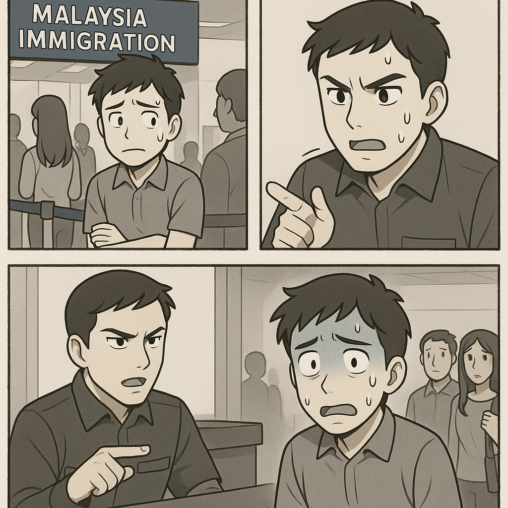

マレーシア移住を考えているあなたへ。長期ビザ取得までの繋ぎとして、ビザランは手軽な選択肢ですが、入国審査で「出国チケット」の提示を求められることも。そこで今回は、ビザランをスムーズにし、マレーシアでの新生活を軽やかにスタートさせるためのANA・JALマイル活用術を徹底解説します！

## 1. ビザランとは？

ビザランとは、ビザなしで滞在できる期間（マレーシアの場合、通常90日間）を超えて滞在するために、一旦隣国などに出国し、すぐに再入国することで滞在期間をリセットする方法です。長期ビザの申請が間に合わない場合や、観光ビザの延長が難しい場合に利用されます。

## 2. なぜ「ビザラン」にANA・JALマイルが有効なのか？

ビザランは、長期ビザ取得までの時間稼ぎに有効ですが、入国審査で不審に思われると入国拒否のリスクも。 **「出国チケット」** は、オーバーステイしない意思を示す強力な証明となり、審査をスムーズに進めるための必須アイテムです。

慣れない海外での入国審査は想像以上にストレスフル。言葉の壁、文化の違い、そして何より「準備不足」が招く緊張感は、せっかくの海外生活のスタートを台無しにしかねません。事前の準備こそが、スムーズな入国と安心できる滞在への第一歩です。

## 3. 出国チケットは「ANA・JAL便」が最強の理由

### 安心感
日本を代表する大手フルサービスキャリアであるANA・JALの信頼度は抜群。入国審査官も安心して受け入れやすい航空会社です。

### 柔軟性
**ANA**のFlex/Standard運賃や**JAL**のフレックス運賃なら、ビザ申請の遅れなど、急な予定変更にも手数料無料または少額で対応可能。

### スムーズな対応
タイムテーブルや料金に関する質問にも、自信を持って即答できます。

多少高くても、変更しやすいANA・JAL便を用意しておくことで、ビザランの精神的な負担を大幅に軽減できます。

## 4. ANA・JALチケットを安く手に入れる秘訣は「マイル活用」

ANA・JALの現金運賃はLCCに比べて高額ですが、特典航空券やマイル＋キャッシュのハイブリッド決済を活用することで、実質コストを数万円単位で圧縮できます。

## 5. 日本出国前に仕込むべき！ANA・JAL系クレジットカード（2025年版）

★＝特におすすめ

### 【ANA系カード】

#### ★ ヤマダLABI ANAマイレージクラブカード（年会費無料）
ヤマダ電機での買い物で100円＝1ポイント（ANAマイルへ移行可能）。年会費無料でANAマイルを貯めたい方の入門カードとして最適。家電購入時のマイル獲得率も魅力的。

### 【JAL系カード】

#### ★ JMBローソンPontaカードVisa（年会費無料）
ローソンでの利用で100円＝2ポイント、その他の利用で100円＝0.5ポイント。貯めたPontaポイントはJALマイルに交換可能（2ポイント＝1マイル）。年会費無料でJALマイルを効率的に貯められる優秀なカード。

#### TOKYU CARD（年会費1,100円）
東急グループでの利用で最大10%のTOKYU POINTが貯まり、JALマイルへの移行も可能。東急沿線ユーザーや渋谷・横浜エリアでの利用頻度が高い方におすすめ。オンライン入会キャンペーン実施中。

## まとめ：スマートなビザランで理想的なマレーシア生活を

いかがでしたか？ビザランは「計画」と「身軽さ」の両立が鍵。信頼のANA・JAL便と貯めたマイル、そして柔軟に使えるANA・JAL系カードを味方に、入国審査の不安を安心へ、コストと手間を自由へ変えてみませんか。

出国チケットをポケットに、次のスタンプを胸に、マレーシア長期滞在への一歩をスマートに踏み出しましょう。 